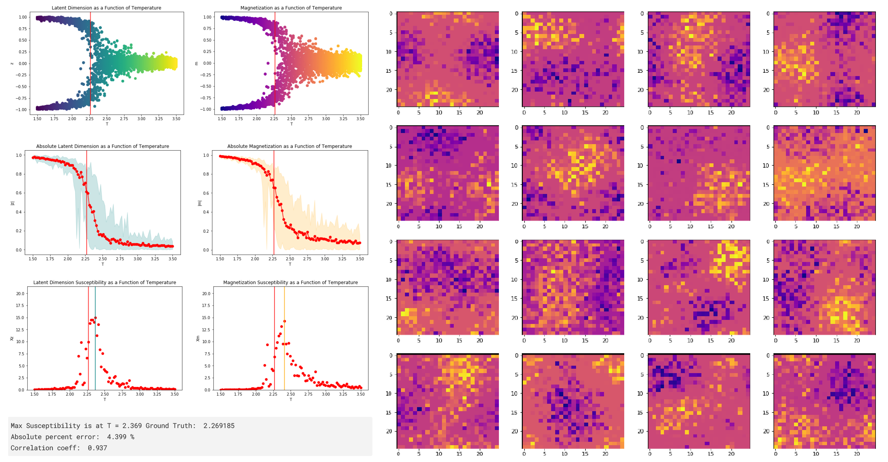

# Deep-Renormalization

This project probes the role which renormalization plays in the operation of (certain) deep neural networks.
It builds on work by Mehta & Schwab (2014), proving the equivalence of training deep belief networks to variational block spin renormalization on the 2D Ising model, and Alexandrou et al. (2019), training an autoencoder on Ising model equilibrium states and showing how the encoded states contain information about the phase transition. It was done in as a final project for our junior undergraduate courses in simulation and in statistical mechanics, and due to this being a collaboration, two reports were written.

Firstly, we replicate the work done by Alexandrou et al. and then probe the results using some of the methods in Mehta & Schwab (2014) to test the hypothesis that the autoencoder converges on block renormalization as an inference technique.

We expand upon Alexandrou et al. by widening the latent dimension, and upon Mehta & Schwab by implementing back propagation to visualize neuron activations in an autoencoder.

While the work revealed many interesting properties of the autoencoder model, the results did not support the hypothesis. The reports summarize the process we used to investigate the hypothesis and reach our conclusion.

